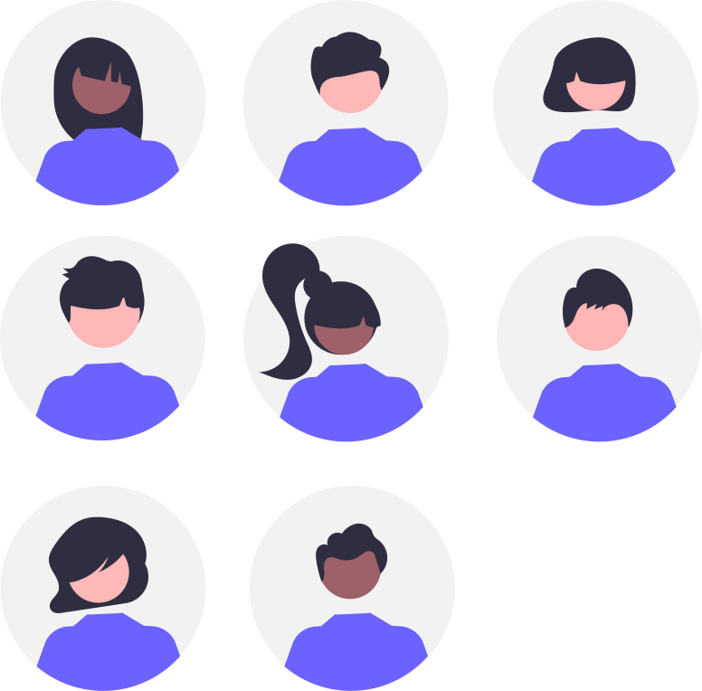

---
hide:
  - toc
---
# **Welcome to documentation of IB-Mentoring**

    

        <h2>Career Guidance for Contributors</h2>
        
Our program offers personalized career guidance tailored to your needs as an emerging professional. You'll be paired with experienced mentors who understand your field and can provide insights on skills development, industry trends, and career planning.

        
Whether you're looking to advance in your current role or pivot to a new field, our mentors are here to help you set and achieve meaningful career goals.

        <a class="cta-button" href="https://forms.gle/6Dk7ZBMp1yAJfHTB9"  style="background-color: pink; color: black;">Participate Now</a>
        <a href="overview.md" class="cta-button">Learn More</a>
    

    

        
    

    

        <h2>Build a Network of Professionals</h2>
        
Expand your professional network by connecting with individuals from diverse fields and backgrounds. Our program encourages collaborative learning and relationship building, helping you establish valuable connections that support your long-term career growth.

        
Through networking opportunities, you’ll gain access to new perspectives, industry insights, and potential collaborations with like-minded professionals.

        <a class="cta-button"  href="https://forms.gle/gwTYc4uQNWBUi7C87" style="background-color: pink; color: black;">Become a Mentor!</a>
        <a href="resources.md" class="cta-button">View Resources</a>
    

    

        
    

    

        <h2>Join a Thriving Community</h2>
        
Become part of a vibrant community that values growth, learning, and collaboration. Our program fosters a supportive environment where you can share your journey, exchange ideas, and contribute to a larger community focused on professional and personal development.

        
Joining our community gives you access to exclusive events, group discussions, and opportunities to contribute to projects that make a difference.

        <a href="https://forum.illyrianbrains.dev/" class="cta-button"  style="background-color: pink; color: black;">Join the Forum!</a>
        <a href="events.md" class="cta-button">See Upcoming Events</a>
    

    

        
    

