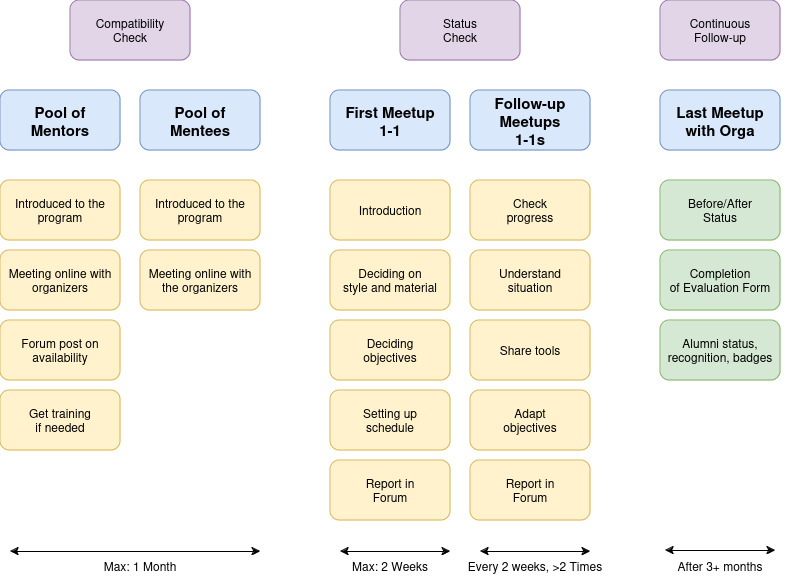
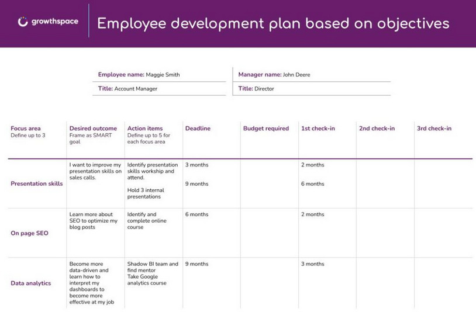
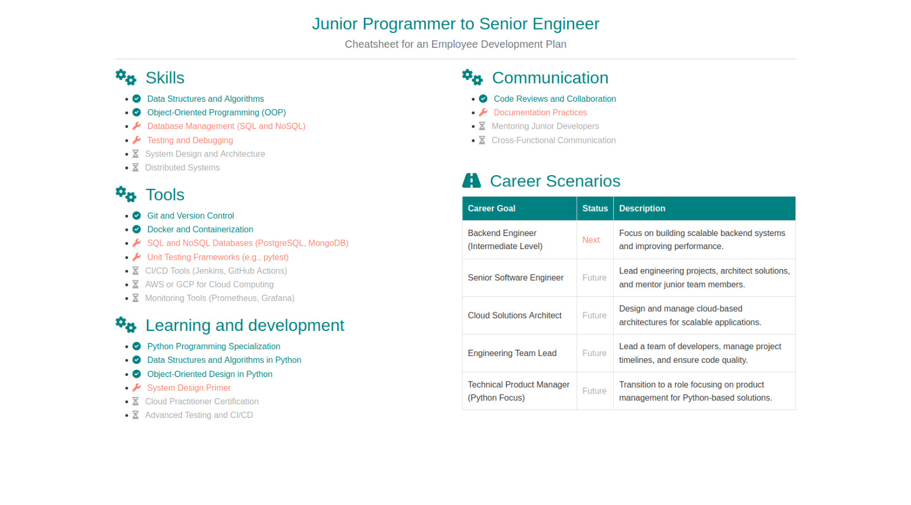
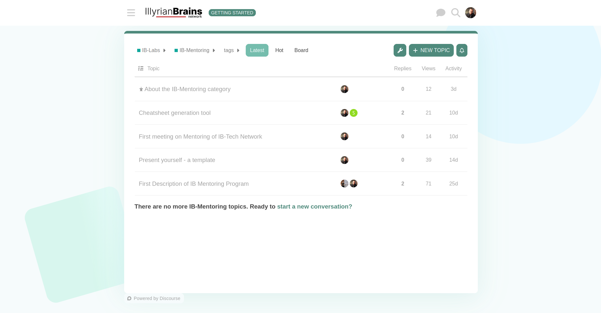

# Program Overview

**Main Idea**: A mentoring program that functions like a Swiss army knife – adaptable, with a solid foundation and multiple tools tailored to the mentor-mentee relationship.

**First Round**: The first iteration of the program lasts around 3 months, with biweekly meetings at minimum. This setup provides a stable framework to evaluate and adjust the mentoring process as needed.

*Visual overview of the program structure and phases.*

---

## Main Steps in the Mentoring Process

1. **Mentor Preparation**  
   Mentors are introduced to the program, learning about its goals and structure. They meet with organizers to discuss responsibilities, ask questions, and confirm availability to participate.

2. **Mentee Preparation**  
   Mentees also meet with organizers to understand the mentoring process and define their goals and expectations. This helps them get ready for productive meetings with mentors.

3. **Initial 1-on-1 Meeting**  
   The first official meeting between a mentor and mentee. They get to know each other, discuss mentoring styles, set clear goals, and decide on a regular meeting schedule.

4. **Ongoing 1-on-1 Meetings**  
   Regular follow-up meetings, held every two weeks or as needed, allow mentors to check on progress, help with challenges, provide advice, and adjust goals.

5. **Final Wrap-Up Meeting**  
   After about three months, mentors, mentees, and organizers come together for a review meeting to assess progress, gather feedback, and conclude the mentoring process. 

!!! info
    Participants may receive certificates or badges for successfully completing the program.

---

## Mentoring Team Follow-Up

- **Compatibility Check**: Mentors and mentees are paired based on shared goals, interests, and availability. Detailed profiles or questionnaires help align expectations and working styles.
  
- **Status Checks**: Regular check-ins, involving both mentors and organizers, help track progress toward mentees' objectives and address any challenges.

- **Continuous Follow-Up**: After the program, ongoing follow-up can assess the impact of mentoring and whether the relationship has continued.

!!! info
    The team monitors progress regularly to ensure a productive and goal-oriented mentorship experience.

---

# Toolkit

## Employee Development Plan

The **Employee Development Plan (EDP)** serves as a foundational tool to facilitate the first interaction between mentor and mentee. It allows mentors to assess initial goals and align them with the mentee’s career aspirations. This plan provides a structured approach to goal setting and tracking.

*Sample Employee Development Plan template for goal setting and tracking.*

!!! info
    Is this type of template something you work with or use at your company? Customizing development plans can make them more relevant to your industry and organizational goals.

---

## Cheatsheet Generator

**Tool Development**: We’re exploring the creation of tools tailored to mentor-mentee interactions. One of these is the **Cheatsheet Generator**, which follows a "5-pillars" framework – Skills, Tools, Learning & Development (L&D), Communication, and Career. This tool aims to simplify and focus on core areas for growth.

*A sample Cheatsheet Generator for structuring mentorship goals across five pillars.*

!!! warning
    This tool is in development and will be refined based on mentor and mentee feedback. It’s intended to be adaptable to a range of career development goals.

---

## Forum

The **Forum** serves as a collaborative space for mentors and mentees to discuss insights, share resources, and participate in group discussions. This platform enhances the community aspect of the program and enables continuous learning and networking outside of one-on-one meetings.

*Screenshot of the forum where mentors and mentees can connect and share resources.*

!!! info
    Engaging in the forum is encouraged, as it fosters a stronger network and provides additional support beyond the structured mentoring sessions.
